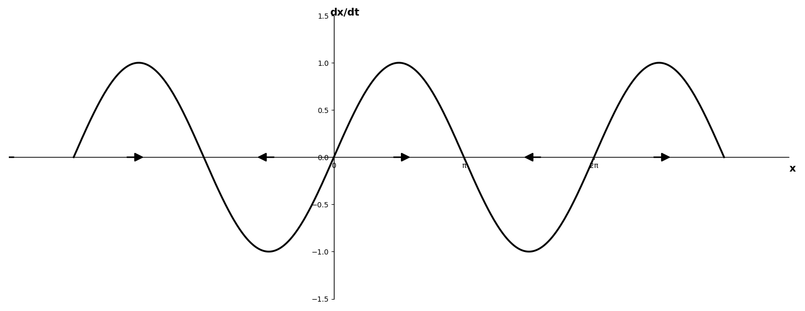
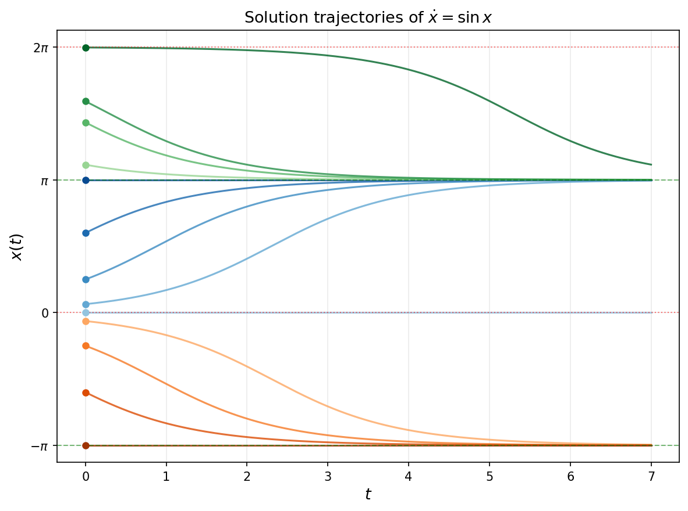

# Chapter 1. Basics of Dynamics
## 1.1 Introduction
Dynamics is the study of how things change over time.

Dynamics examines:
1. How systems evolve — what happens as time passes
2. Rules of change — the laws or equations governing the motion
3. Future behavior — predicting what will happen next

Dynamics has two forms, differential equations and difference equations. Let's focus on differential equations as it's more common when solving real problems.At its core, dynamics answers the question: "Given the current state, what happens next?" So it focuses on a narrower type of diffrential equations, ordinary differential equations with time as varible, written most simply as

$$
\frac{dx}{dt} = f(x).
$$

The key restriction: $f$ depends on $x$, not $t$

Notice what is *missing* from the right-hand side: there is no explicit $t$. The rate of change of $x$ depends only on the **current value of $x$**, never on the clock reading at that moment. An equation of this form is called **autonomous**.

In the non-autonomous case the law of motion itself changes as time passes — as if an outside force were being switched up and down on a schedule. In the autonomous case there is no such external clock. **The same state always produces the same velocity**, no matter *when* the system visits that state.

This is not a minor technicality. The whole subject of dynamics, including chaos, is built on autonomous systems, and the assumption "$f$ depends on $x$ alone" is what gives them their structure.

### Why this restriction matters

**1. Time does not have an origin.** If $x(t)$ is a solution, then $x(t + c)$ is also a solution for any constant $c$. Sliding a trajectory forward or backward in time produces another valid trajectory. Only *elapsed* time matters, not absolute time. We say the system is **time-translation invariant**.

**2. The present determines the entire future (and past).** Because the velocity $\dot x$ is fixed the instant we know $x$, the future is completely determined by the current state. There is no hidden time-dependence that could surprise us later. This is what we mean when we call such systems **deterministic**.

**3. We can reason geometrically.** Since $f$ assigns a single velocity to each value of $x$, we can draw $f(x)$ as a *velocity field* on the line of possible states and read off the behavior directly — often without solving the equation at all. This geometric viewpoint, developed in the next sections, is the most powerful tool we have.

### A few simple examples

Before developing the general theory, let us look at the simplest autonomous ODEs. Each one illustrates a different qualitative behavior.

Note, $\frac{dx}{dt}$ is often written as  $\dot x$ in dynamics.
### Example 1: The simplest of all, $\dot x = a$

$$
\frac{dx}{dt} = a \quad (a \text{ constant}).
$$

Here $f(x) = a$ does not even depend on $x$. Integrating directly,

$$
x(t) = x_0 + a t,
$$

where $x_0 = x(0)$. The state drifts at a constant velocity forever. If $a \neq 0$ there are no fixed points: the particle never stops. This is uniform motion — the dynamical equivalent of "nothing interesting happens."

### Example 2: Exponential growth and decay, $\dot x = a x$

$$
\frac{dx}{dt} = a x.
$$

This is the most important linear equation in all of science. Separating variables,

$$
\frac{dx}{x} = a\,dt \;\Longrightarrow\; \ln|x| = a t + C \;\Longrightarrow\; x(t) = x_0\, e^{a t}.
$$

 

### Example 3: Logistic growth, $\dot x = r x (1 - x)$

A population cannot grow exponentially forever; resources run out. The logistic equation builds in a ceiling:

$$
\frac{dx}{dt} = r x\left(1 - x\right), \qquad r > 0,
$$

where $x$ is the population measured as a fraction of the maximum the environment can support.

### Example 4: The pendulum, $\ddot x + \frac{g}{L}\sin x = 0$

A mass on a frictionless rod of length $L$, swinging under gravity. Let $x$ be the angle from the vertical. Newton's second law gives

$$
\frac{d^2 x}{dt^2} + \frac{g}{L}\sin x = 0.
$$

This is a **second-order** ODE — it involves $\ddot x$. But our framework so far only handles first-order equations $\dot x = f(x)$. The standard trick is to introduce the angular velocity as a second variable, converting one second-order equation into two coupled first-order ones.

**Introducing the velocity variable.** Let

$$
y = \dot x,
$$

so $y$ is the angular velocity. Then $\dot y = \ddot x$, and the pendulum equation becomes

$$
\dot x = y, \qquad \dot y = -\frac{g}{L}\sin x.
$$

This is a **first-order system** in the two-dimensional state $(x, y)$:

$$
\frac{d}{dt}\begin{pmatrix} x \\ y \end{pmatrix} = \begin{pmatrix} y \\ -\dfrac{g}{L}\sin x \end{pmatrix} =: \mathbf{f}(x, y).
$$

The right-hand side depends only on the current state $(x, y)$, not on $t$ — so the system is still **autonomous**.

So in general, we introduce the general form of first-order system:

$$
\dot x_1=f_1(x_1,x_2,...,x_n) \\
\vdots  \\
\dot x_n=f_n(x_1,x_2,...,x_n) 
$$

## 1.2 Flow on the line
As a simple example, consider:

$$
 \dot x= \sin x 
$$       

To understand the solution behavior, it helps to interpret this equation geometrically as a vector field on the line. In the figure,

$t$ is time, $x$ is the particle's position on the real line, and $\dot x$ is its velocity. The equation $\dot x = \sin x$ assigns each position $x$ a velocity $\dot x$, which we represent as a vector at that point.

When $\dot x > 0$, the particle moves to the right; when $\dot x < 0$, it moves to the left, as the picture shows. Points where $\dot x = 0$ are stationary. Such points are called **fixed points**.

For $\dot x = \sin x$, the fixed points occur wherever $\sin x^* = 0$, that is at $x^* = n\pi$ for integer $n$.

Not all fixed points behave the same way. Look at the arrows on both sides of a fixed point:

- A **stable fixed point** is one toward which the arrows on both sides point. If the particle starts nearby — slightly to the left or slightly to the right — both flow directions push it back toward $x^*$. The fixed point acts like an attractor. For $\dot x = \sin x$, the points $x^* = \ldots, -\pi, \pi, 3\pi, \ldots$ (odd multiples of $\pi$... wait, let us be precise): at $x^* = 0$, $\sin x > 0$ just to the right and $\sin x < 0$ just to the left, so arrows point *away* — that is unstable. At $x^* = \pi$, $\sin x < 0$ just to the right (particle pushed left, toward $\pi$) and $\sin x > 0$ just to the left (particle pushed right, toward $\pi$) — arrows converge. So $x^* = \pi$ is a **stable fixed point**, as are $x^* = -\pi, 3\pi, \ldots$ (i.e. odd multiples of $\pi$ with the appropriate sign).

- An **unstable fixed point** is one away from which the arrows point on both sides. A particle placed exactly there stays forever, but the slightest nudge carries it away, never to return. For $\dot x = \sin x$, the points $x^* = 0, \pm 2\pi, \ldots$ (even multiples of $\pi$) are of this type.

**Why stable fixed points matter: long-term trapping.**
Suppose the particle starts at some position $x_0$ near a stable fixed point $x^*$. Because the arrows in the neighborhood all point toward $x^*$, the particle is continuously driven closer. It never overshoots and escapes — this is a one-dimensional flow, so the particle cannot pass through $x^*$ itself (that would require zero velocity, and then it would stop). The particle therefore remains in a neighborhood of $x^*$ for all future time, approaching it asymptotically:

$$
x(t) \to x^* \quad \text{as } t \to \infty.
$$

This is the precise meaning of stability: **small perturbations away from $x^*$ decay rather than grow**. The stable fixed point is the inevitable long-run destination for every initial condition in its neighborhood.

By contrast, near an unstable fixed point any tiny displacement is amplified by the flow. In practice, a particle placed "at" an unstable fixed point always has some infinitesimal perturbation — numerical round-off, physical noise — and that perturbation is enough to send it away. Unstable fixed points are rarely observed in nature; stable ones are.

Based on above observation, we can esitmate that for the particle starting at $0$, $\pi$ , $2\pi$..., it will be stationary, for particle starting between $(0,2\pi)$, it will converge to the stable fixed point $\pi$, for the  particle starting between $(-2\pi,0)$, it will converge to the stable fixed point $-\pi$. Without solving the equation, we can draw the picture of the solution.

  

## 1.3 Fixed point stability analysis
Let's give a formal definition of the stability of a fixed point.

**Definition (Lyapunov Stability):** A fixed point $x^*$ is **stable** if:

For every $\epsilon > 0$, there exists $\delta > 0$ such that whenever $|x(0) - x^*| < \delta$, we have $|x(t) - x^*| < \epsilon$ for all $t \geq 0$.

In other words, for any given tolerance ε, there exists a neighborhood of the initial condition such that all solutions originating from initial values within this neighborhood remain within ε of the reference solution.

Since $x^*$ is a fixed point, $f(x^*) = 0$.

For $x$ near $x^*$, use Taylor expansion:

$$f(x) = f(x^*) + f'(x^*)(x - x^*) + O((x - x^*)^2)$$

$$f(x) = f'(x^*)(x - x^*) + O((x - x^*)^2)$$

Define the perturbation: $\xi(t) = x(t) - x^*$, 

> note $x(t)$ is the solution of the initial condition $x(0)=x$, and $x^*$ is the solution of the initial condition $x(0)=x^*$,which is a constant value function, $\xi=x-x^*<\delta$

Then:
$$\dot{\xi}(t) = \dot{x}(t) = f(x(t)) = f(x^* + \xi(t))$$

$$\dot{\xi}(t) = f'(x^*)\xi(t) + O(\xi^2)$$

The **linearized system** near $x^*$ is:
$$\dot{\xi} = f'(x^*) \xi$$

This is called the **linear (or variational) equation** at the fixed point.

The linearized equation $\dot{\xi} = \lambda \xi$ where $\lambda = f'(x^*)$ has the general solution:

$$\xi(t) = \xi(0) e^{\lambda t}$$

**Case 1: $\lambda = f'(x^*) < 0$**

$$\xi(t) = \xi(0) e^{\lambda t} \to 0 \text{ as } t \to \infty$$

The perturbation decays exponentially. For the original system:

$$x(t) = x^* + \xi(t) \to x^* \text{ as } t \to \infty$$

**Case 2: $\lambda = f'(x^*) > 0$**

$$\xi(t) = \xi(0) e^{\lambda t} \to \infty \text{ as } t \to \infty$$

(for any $\xi(0) \neq 0$)

The perturbation grows exponentially away from the fixed point.Thus, $x^*$ is unstable.

**Case 3: $\lambda = f'(x^*) = 0$**

The linear analysis cannot determine the stability and requires non-linear analysis.

Examples:
For each system, identify the fixed point and determine stability:

1. **$\dot{x} = e^x - 2$**
   - Fixed point: $e^{x^*} = 2 \Rightarrow x^* = \ln 2$
   - Derivative: $f'(x) = e^x \Rightarrow f'(\ln 2) = 2 > 0$
   - Stability: **Unstable** 

2. **$\dot{x} = \cos(x) - x$**
   - Fixed point: $\cos(x^*) = x^*$ (transcendental, but exists)
   - Derivative: $f'(x) = -\sin(x) - 1 \Rightarrow f'(x^*) = -\sin(x^*) - 1 < -1$
   - Stability: **Stable** (since $f'(x^*) < 0$) 

3. **$\dot{x} = \sin(\pi x)$**
   - Fixed points: $\sin(\pi x^*) = 0 \Rightarrow x^* = n$ for $n \in \mathbb{Z}$
   - Derivative: $f'(x) = \pi\cos(\pi x)$
   - At $x^* = 0$: $f'(0) = \pi > 0$ → **Unstable**
   - At $x^* = 1$: $f'(1) = -\pi < 0$ → **Stable**
   - At $x^* = 2$: $f'(2) = \pi > 0$ → **Unstable** 

## 1.4 Existence-Uniqueness Theorem
In the preceding discussion, we overlooked the uniqueness of solutions. If multiple trajectories pass through a single point, or if trajectories intersect, geometric analysis becomes invalid.Let's look at an example:

$\dot x=x^\frac{1}{3}$,starting from $x_0=0$.

$x=0$ is a fixed point, so $x(t)=0$ is its solution. However, there's a different solution.

$$ \frac{dx}{dt} = x^\frac{1}{3}$$
$$ x^ {-\frac{1}{3}} dx=dt $$
$$ \int x^ {-\frac{1}{3}}dx=\int dt $$
$$ \frac{3}{2}x^{\frac{2}{3}}=t+C  $$
with initial contion $x(0)=0$ we know $C=0$, so

$$ x(t)= (\frac{2}{3}t)^\frac{3}{2} $$
is also a solution.

The root cause of uniqueness is the derivative of x(t) is infinite at t = 0.

We will provide a sufficient condition for the uniqueness of the solution, the proof of the statement is beyond the scope of the topic.

**Statement:**
Consider the initial value problem:
$$\frac{dx}{dt} = f(x), \quad x(t_0) = x_0$$

If $f(x)$ and $\frac{df}{dx}$ are continuous in an interval 
$$ R = \{x: |x-x_0| < a\} $$

then there exists $h > 0$ and a unique solution $x(t)$ defined for $|t-t_0| < h$.